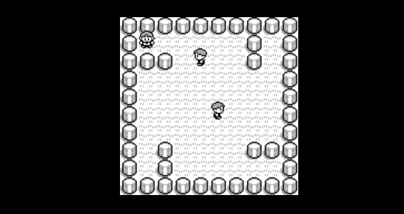

# socket-io-demo

socket.ioとcreatejsを使ったデモ



[Demoページ](http://socket-io-demo.sawa-zen.com)

## Description

socket.ioのWebsocket通信と、createjsのcanvasによる描画で、
適当なオンラインゲームのようなものができないか試してみたものです。
良かったら参考にしてください。

## Requirement

- npm
- bower
- nginx

## Usage

1. 必要な node モジュールのインストール
  ```
  $ npm install
  ```

1. 必要な bower モジュールをインストール

  ```
  $ bower install
  ```

1. `npm run start` を叩いてファイルのwatchを開始
  ```
  $ npm run start
  ```

1. `public/index.html`にアクセスでき、nginx 経由で websocket 通信ができるように `nginx.conf` を設定
  ```
      /** 略 **/

      # canvas
      upstream io_nodes {
          ip_hash;
          # 起動しているsocket.ioの接続先URL
          server 127.0.0.1:1080;
      }
      server {
          listen       80;
          server_name  socket-io-demo.localhost;

          location / {
              root   [プロジェクトのroot]/public;
              index  index.html index.php;
          }

          # Webブラウザからsocket.ioにアクセスする際のパス`/socket.io/`だった場合、socket.ioに転送(Proxy)
          location /socket.io/ {
              proxy_set_header Upgrade $http_upgrade;
              proxy_set_header Connection "upgrade";
              proxy_set_header X-Forwarded-For $proxy_add_x_forwarded_for;
              proxy_set_header Host $host;
              proxy_http_version 1.1;
              proxy_pass http://io_nodes;
          }
      }

      /** 略 **/
  ```

1. `nginx.conf`の再読み込み
  ```
  $ sudo nginx -s reload
  ```
1. 別セッションでサーバ起動

   ```
   $ node public/server.js
   ```

1. ブラウザで確認
  ```
  http://socket-io-demo.localhost
  ```

## Install
```
$ git clone git@github.com:canvas-ncu/socket-io-demo.git
```

## Author

[@sawa-zen](https://github.com/sawa-zen)
